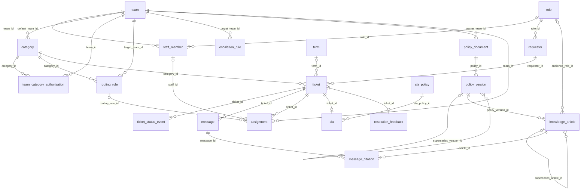

# ER Diagram

_Generated. Optional FKs use `|o`; bridge tables show 1:N from both parents._

```mermaid
erDiagram
    team ||--o{ staff_member : "team_id"
    role ||--o{ staff_member : "role_id"
    role ||--o{ requester : "role_id"
    team ||--o{ category : "default_team_id"
    team ||--o{ team_category_authorization : "team_id"
    category ||--o{ team_category_authorization : "category_id"
    category ||--o{ routing_rule : "category_id"
    team ||--o{ routing_rule : "target_team_id"
    team ||--o{ escalation_rule : "target_team_id"
    team ||--o{ policy_document : "owner_team_id"
    policy_document ||--o{ policy_version : "policy_id"
    policy_version |o--o{ policy_version : "supersedes_version_id"
    policy_version ||--o{ knowledge_article : "policy_version_id"
    role |o--o{ knowledge_article : "audience_role_id"
    knowledge_article |o--o{ knowledge_article : "supersedes_article_id"
    requester ||--o{ ticket : "requester_id"
    category ||--o{ ticket : "category_id"
    term |o--o{ ticket : "term_id"
    ticket ||--o{ ticket_status_event : "ticket_id"
    ticket ||--o{ message : "ticket_id"
    message ||--o{ message_citation : "message_id"
    knowledge_article ||--o{ message_citation : "article_id"
    ticket ||--o{ assignment : "ticket_id"
    team ||--o{ assignment : "team_id"
    staff_member |o--o{ assignment : "staff_id"
    routing_rule |o--o{ assignment : "routing_rule_id"
    ticket ||--o| sla : "ticket_id"
    sla_policy ||--o{ sla : "sla_policy_id"
    ticket ||--o| resolution_feedback : "ticket_id"
```
